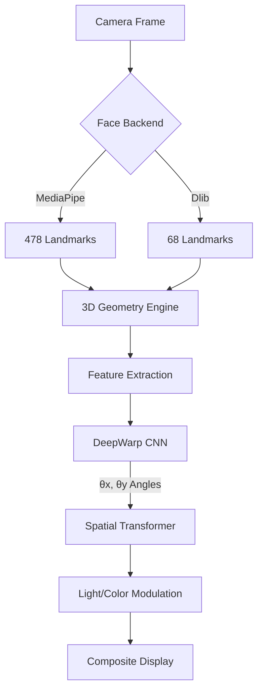

# Cursor Gaze

[](https://www.python.org/downloads/)
[](https://www.apple.com/macos/)
[](https://opensource.org/licenses/MIT)

**Cursor Gaze** is a professional, real-time eye gaze redirection engine designed for modern video communication. By leveraging state-of-the-art computer vision and deep warping neural networks, it dynamically adjusts your eye gaze to ensure you appear as though you are looking directly at your audience - even when you're looking at your screen.

> [!TIP]
> **Cursor Gaze** is optimized for **Apple Silicon (M1/M2/M3)**, utilizing native CoreML acceleration for ultra-low latency inference.

---

## Quick Start (60 Seconds)

If you have `brew` and `poetry` installed, you can be up and running in minutes:

```bash
# 1. Install build dependencies
brew install cmake pkg-config

# 2. Clone and install
git clone https://github.com/Sahil-Bhoite/CursorGaze.git
cd CursorGaze
poetry install

# 3. Launch the app
poetry run python cursor_gaze.py
```

---

## Core Features

*   **Real-Time Redirection**: Smooth, 30+ FPS Cursor Gaze correction with zero lag.
*   **Apple Silicon Native**: Built-in support for **CoreML** and **TFLite** GPU acceleration.
*   **Dual Face Backends**:
    *   **MediaPipe**: High-speed, 478-point mesh detection (Recommended).
    *   **Dlib**: Classic, high-precision 68-point facial landmarking.
*   **Interactive 3D Calibration**: Dynamically adjust camera-to-eye geometry in a 3D interface.
*   **OBS Virtual Camera Support**: Steam your corrected gaze directly into Zoom, Teams, or Google Meet.
*   **Natural Aesthetics**: Advanced light color modulation and histogram matching to prevent "uncanny valley" effects.

---

## Installation & Setup

### 1. System Requirements
*   **Hardware**: Mac with Apple Silicon (Recommended) or high-perf Intel Mac.
*   **Software**: macOS 14.0+, Python 3.11+.

### 2. Dependency Setup
```bash
brew install pkg-config cmake
poetry install
```

### 3. Pre-trained Models
Download the following assets from [GitHub Releases](https://github.com/Sahil-Bhoite/CursorGaze/releases):

| Model Category | File Path | Purpose |
| :--- | :--- | :--- |
| **Dlib Landmarks** | `lm_feat/shape_predictor_68_face_landmarks.dat` | Precision facial tracking |
| **Warping Weights** | `weights/cursor_gaze_v1/flx/12/[L|R]/` | CNN weights for eye redirection |
| **MediaPipe Task** | `models/face_landmarker.task` | Ultra-fast face mesh tracking |

---

## Usage & Controls

### Main Application
The unified interface for Cursor Gaze is `cursor_gaze.py`:

```bash
# Basic usage (MediaPipe + TFLite)
poetry run python cursor_gaze.py

# Switch to Dlib backend for high precision
python cursor_gaze.py --backend dlib

# Use a specific external camera
python cursor_gaze.py --camera 1

# Output to OBS Virtual Camera
python cursor_gaze.py --virtual-cam
```

### Interactive Commands
| Key | Action |
| :---: | :--- |
| `g` | **Toggle Cursor Gaze** (On/Off) |
| `c` | **Enter Calibration Mode** |
| `q` | **Safe Quit** |

---

## Interactive Calibration Mode

When in Calibration Mode (press `c`), use the following keys to fine-tune the 3D geometry of your setup. Your settings are automatically saved to `user_settings.db`.

| Control | Action | Target |
| :--- | :--- | :--- |
| `↑` `↓` | Adjust Y-Offset | Camera height relative to screen |
| `←` `→` | Adjust X-Offset | Horizontal centering |
| `+` `-` | Adjust Z-Offset | Screen depth/distance |
| `[` `]` | Focal Length | Camera field-of-view matching |
| `r` | **Reset** | Revert to factory defaults |

> [!NOTE]
> The calibration overlay provides a **Top-Down 3D Visualization** showing the relative distance between your eyes, the screen, and the camera. Use this to ensure your eye-tracking math is millimeter-perfect.

---

## Technical Architecture

Cursor Gaze operates on a decoupled architecture, separating detection, estimation, and rendering into distinct layers.



### 1. The 3D Geometry Engine
The system calculates a "correction vector" based on your physical location in space relative to the camera. It estimates:
- **Pitch/Yaw Offset**: The angular difference between looking at the screen center vs the camera lens.
- **Dynamic IPD**: Adjusts for Inter-Pupillary Distance as you move closer or further from the sensor.

### 2. DeepWarp Convolutional Network
Instead of simple image warping, the **DeepWarp** model predicts a pixel-displacement flow field. This preserves the texture of your iris and the clarity of your reflection, avoiding the blurring associated with traditional affine transforms.

### 3. Inference Hierarchy
To ensure thermal efficiency on MacBooks, the engine prioritizes inference as follows:
1.  **CoreML** (Neural Engine / GPU)
2.  **TFLite** (Accelerated via Metal/MPS)
3.  **TF Graph** (CPU Fallback)

---

## Troubleshooting

*   **Camera Not Opening**: Ensure no other apps (Zoom, Teams) are using the camera. On macOS, check **System Settings > Privacy > Camera**.
*   **Low FPS**: If you are on an Intel Mac, try disabling certain features. Use the `--backend mediapipe` flag for better performance.
*   **"Wobbly" Eyes**: This is usually due to improper lighting. Ensure your face is evenly lit to help the landmark detectors stay stable.

---

## Acknowledgments & License
Based on research in real-time gaze redirection using warping-based CNNs. Licensed under the [MIT License](LICENSE).

Developer: **Sahil Bhoite** ([work.sahilbhoite@gmail.com](mailto:work.sahilbhoite@gmail.com))
